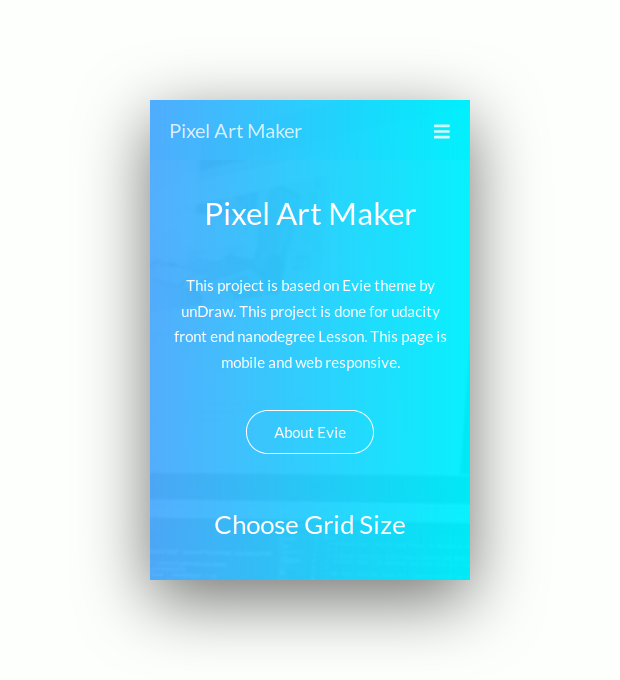
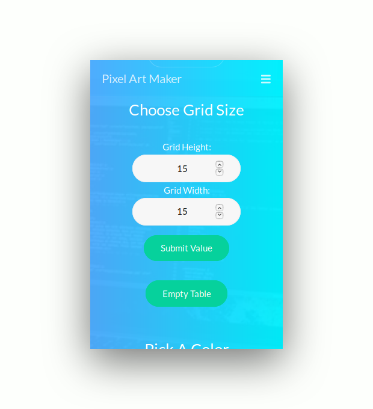
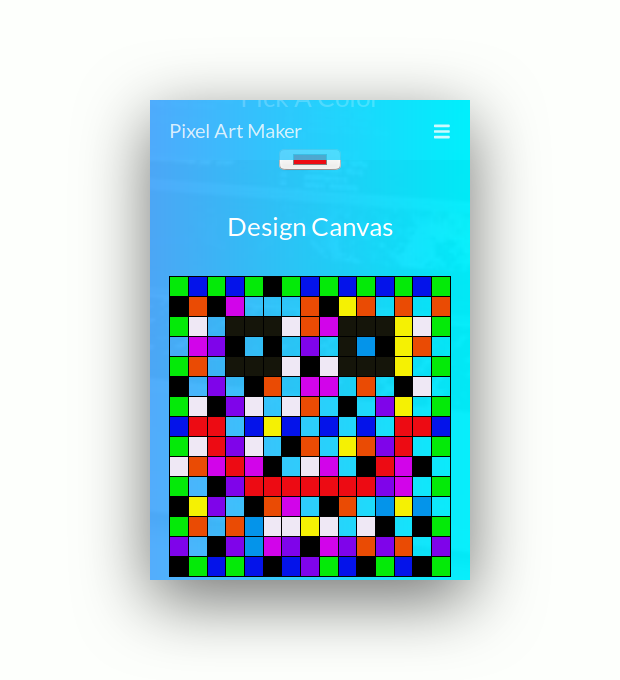
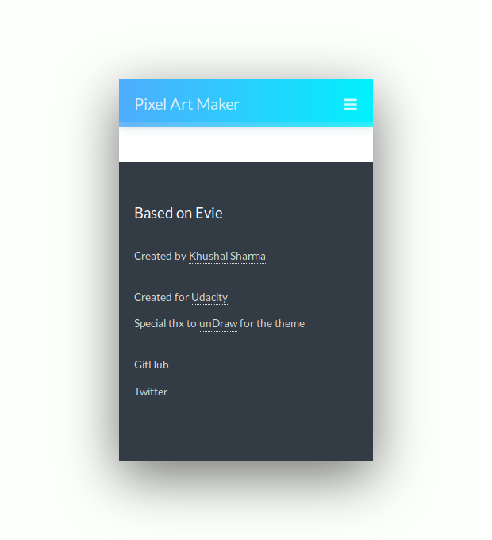
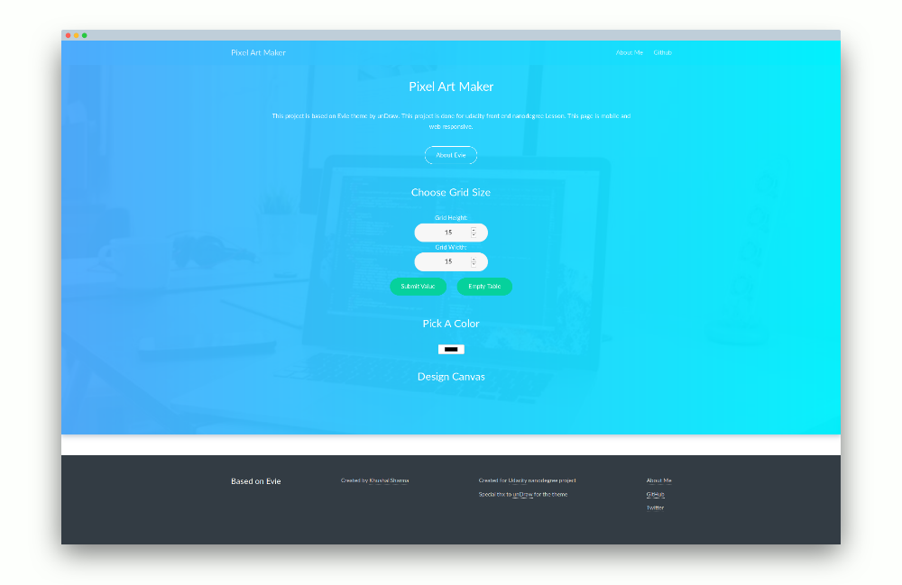

# PixelArtMaker
This Repo contains Code for [Pixel Art Maker](http://logan1x.github.io/PixelArtMaker/) project done for Udacity nanodegree.This is web app that allows users to draw pixel art on a customizable canvas! 
The project is based on [Evie](https://evie.undraw.co) theme by unDraw. Evie is an [MIT licensed](https://evie.undraw.co/additional) template bundled with a minimal style guide to build websites faster.

This page is Web and Mobile responsive.
Here are some samples screenshots to see how website looks like.

---

### Mobile View

        
        
        
        

---

### Web View

---

##### Want to use to it for personal project, see [`LICENSE`](https://github.com/Logan1x/PixelArtMaker/blob/master/LICENSE).

##### Made some changes, want me to add

1. Fork it (<https://github.com/Logan1x/PixelArtMaker/fork>)
2. Create your feature branch (`git checkout -b feature/fooBar`)
3. Add your docs in `docs/data.json` file
4. Commit your changes (`git commit -am 'Add some fooBar'`)
5. Push to the branch (`git push origin feature/fooBar`)
6. Create a new Pull Request
7. Add your name with a link to your profile in the contributors list
