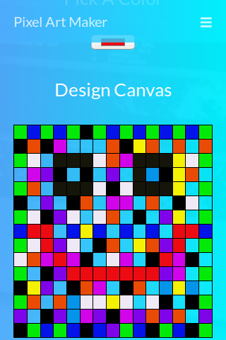

# PixelArtMaker
This Repo contains Code for [Pixel Art Maker](http://logan1x.me/PixelArtMaker/) project done for udacity nanodegree.
This page is Web and Mobile responsive.
Here are some samples how website looks like.

      
